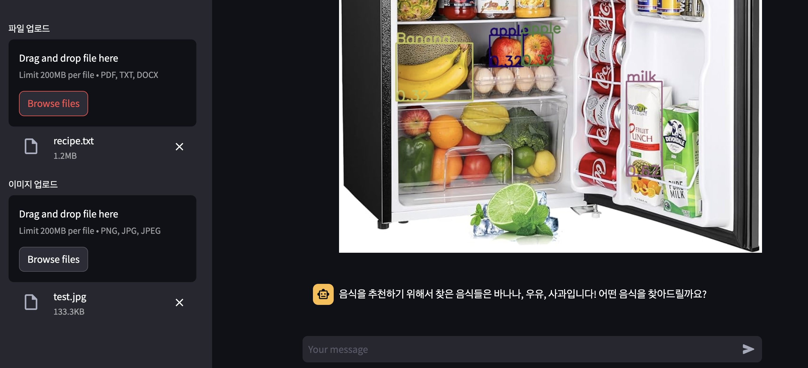
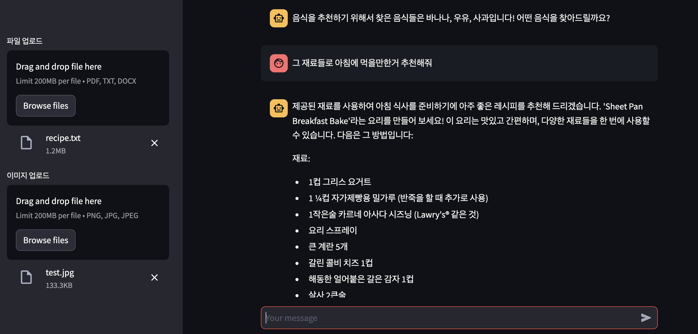
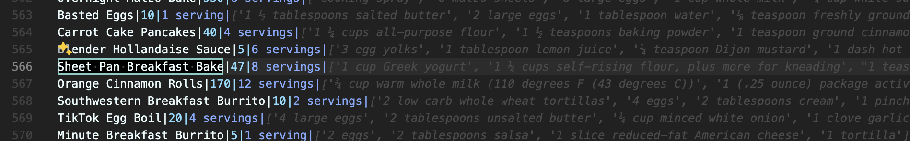

## COOKING MASTER with SOLAR

---

### Description

This project is a recipe search website created using llama3. When users upload a photo of their refrigerator, YOLO recognizes the ingredients inside, and recipes are searched from the Knowledge Database using RAG and recommended to the user. The server and client are built separately.

---

### Features

#### SOLAR

Used model : https://huggingface.co/heegyu/EEVE-Korean-Instruct-10.8B-v1.0-GGUF

##### About the Model

This model is a fine-tuned version of yanolja/[EEVE-Korean-10.8B-v1.0](https://huggingface.co/yanolja/EEVE-Korean-10.8B-v1.0), which is a Korean vocabulary-extended version of upstage [SOLAR-10.7B-v1.0](https://huggingface.co/upstage/SOLAR-10.7B-v1.0). Specifically, we utilized Direct Preference Optimization (DPO) through the use of [Axolotl](https://github.com/OpenAccess-AI-Collective/axolotl).

#### YOLO v8

Used model : https://github.com/ultralytics/ultralytics

##### About the Model

Ultralytics YOLOv8 is a cutting-edge, state-of-the-art (SOTA) model that builds upon the success of previous YOLO versions and introduces new features and improvements to further boost performance and flexibility. YOLOv8 is designed to be fast, accurate, and easy to use, making it an excellent choice for a wide range of object detection and tracking, instance segmentation, image classification and pose estimation tasks.

YOLO Training Data : https://universe.roboflow.com/ggsipu-vc4iw/fc-vww2r

* The training was conducted on Colab.
* The best.pt file is a pre-trained model and no further training is required.

#### RAG

For the Knowledge Database, I used data crawled from allrecipe.com. The data is stored in a vectorized database through Facebook's FAISS and RAG provides answers to user queries.

The data for the Knowledge DataBase can be crawled using __Recipe_Crawling/crawling.ipynb__. Pre-crawled data is stored in __Recipe_Crawling/recipe.txt__.

---

### Overall Structure

1. Users upload the recipe data.
2. The data is stored in the vectorized database via FAISS.
3. Users upload a photo of their refrigerator.
4. YOLO recognizes the ingredients inside the refrigerator.
5. The recognized ingredients are searched for necessary recipes with llama3, and recommendation is provided to the user.

---

### Example



* When a refrigerator photo is uploaded, YOLO recognizes the ingredients inside and displays them.
* When the __Recipe_Crawling/recipe.txt__ file is uploaded, it is stored in the vectorized database via FAISS.



* When users search for a recipe, RAG provides recommendations.
  


* You can see that the information in recipe.txt is actually searched.

---

### Installation

1. Install ollama from https://ollama.com/ 

2.  Download the model (ggml-model-Q4_K_M.gguf) from https://huggingface.co/heegyu/EEVE-Korean-Instruct-10.8B-v1.0-GGUF and move it to __ollama-modelfile/EEVE-Korean-Instruct-10.8B-v1.0.__    

Or you can use the following commands:

``` bash

pip install huggingface-hub 

huggingface-cli download \
  heegyu/EEVE-Korean-Instruct-10.8B-v1.0-GGUF \
  ggml-model-Q4_K_M.gguf \
  --local-dir {direction want to download} \
  --local-dir-use-symlinks False
```

3. ollama create

``` bash
ollama create EEVE-Korean-10.8B ollama-modelfile/EEVE-Korean-Instruct-10.8B-v1.0/Modelfile
```

4. ollama start

* Pleas change the direction to the direction where your COOKING MASTER with SOLAR is located.

``` bash
ollama list # You can check installed models with the ollama list command.
ollama run EEVE-Korean-10.8B:lastest # Run the specified model.
```

5. Install the required packages.

``` bash
pip install -r requirements.txt
```

* __Note: This setup is based on Python 3.11. For smooth operation, please use Python 3.11.__

---

### Usage

1. Set up the GPU.

In the __LOCAL/RAG.py__ file, set up the GPU as follows:

``` python
    model_kwargs = {
        # "device": "cuda"     # - NVidia GPU: "cuda"
        "device": "mps"        # - Apple Silicon GPU: "mps"
        # "device": "cpu"      # - CPU: "cpu"
    }
```

2. Ensure ollama is running:

``` bash
ollama run EEVE-Korean-10.8B:lastest
```

3. Start the server:

``` bash
python SERVER/server.py
```

4. Start the client:

``` bash
streamlit run LOCAL/main.py
```

5. Upload the recipe.txt file. You can use the recipe.txt

6. Upload a photo of your refrigerator.

7. Let's enjoy the recipe search!

---

### References

[YOLO v8](https://github.com/ultralytics/ultralytics)
[YOLO Training Data](https://universe.roboflow.com/ggsipu-vc4iw/fc-vww2r)
[Streamlit](https://docs.streamlit.io/)
[FAISS](https://github.com/facebookresearch/faiss)
[Langchain](https://python.langchain.com/v0.1/docs/get_started/introduction/)
[Wikidocs - Langchain](https://wikidocs.net/book/14473)
[Recipe Crawling Library](https://github.com/hhursev/recipe-scrapers)
[Recipe Source](https://www.allrecipes.com/)